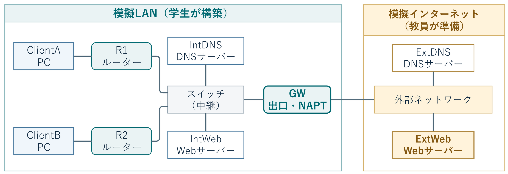
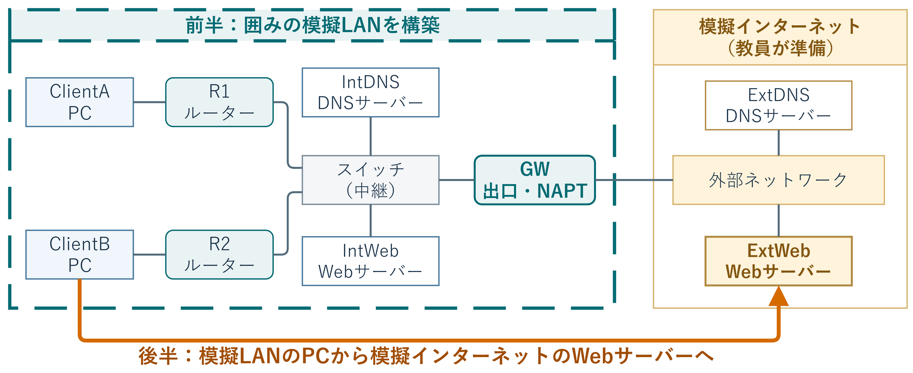
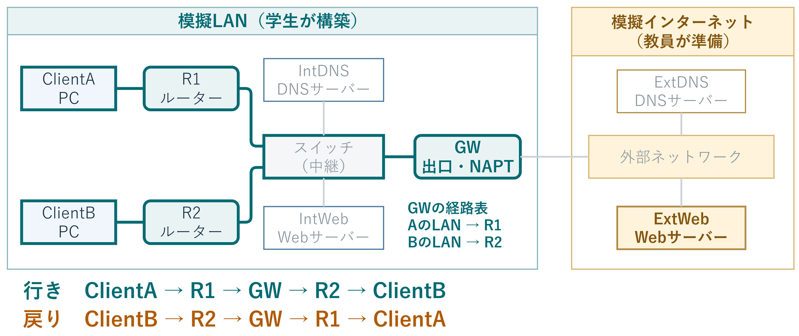
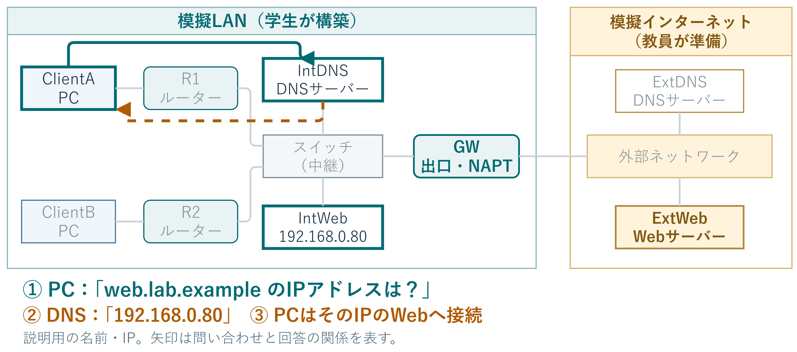
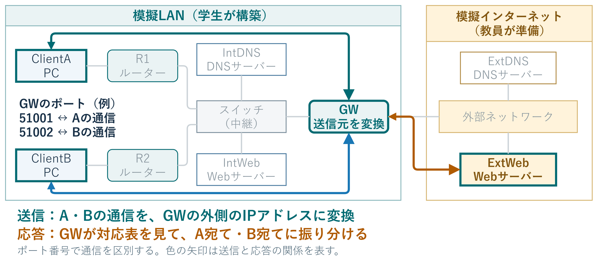

# 3B情2 ネットワーク構築

## 実験の概要

インターネットとLANを模擬したネットワークを、  
ノートPCとネットワークOS（VyOS）を用いて構築する。

模擬LANのPCから模擬インターネットのWebサーバーに接続する。

通信が成立する理由を、設定と観察結果から説明する。

---

# この実験でできるようになること

- LANケーブルでネットワーク機器を接続する。
- Linuxの基本操作で、コマンドの実行やファイルの編集を行う。
- 機器の役割を理解し、IPアドレスと通信経路を設定する。
- 疎通・経路・名前解決・アドレス変換を観察する。
- ルーティング、DNS、NAPTが連携する仕組みを説明する。

E4PBLサイバーセキュリティで必要なネットワークの知識を学ぶ。

---

# 持ってくるもの

## 持参するもの

- 実験ノート
- スマホ
- 動画資料視聴のためのイヤフォン
- マウス

## 可能なら持参するもの

- ノートPC
- ノートPCを有線LANに接続するためのアダプター

---

# 構築する機器と役割

模擬LANのPCから、GWを経由して模擬インターネットへ接続する。

---

# 実験の進め方

---

# 通信には、行きと戻りの道順が必要

---

# DNSで、名前からIPアドレスを調べる

---

# NAPTで、2台のPCへの応答を振り分ける

---

# 通信を確認して、ノートに残す

`ping` は、指定した相手から応答が返るかを確かめるコマンド。

## 例：ClientAからR1（192.168.1.1）へ

`ping -c 4 192.168.1.1`（Linuxで4回送信。IPは説明用）

## 実験ノートの記録例

「ClientAからR1へ4回送信し、4回応答した。損失0%。」

分かったこと：ClientAとR1の間で通信できた。

---

# R1には届くのに、Webには届かない

例：ClientAからR1へのpingは成功。WebのIPへのpingは失敗。

| 次に確認すること | 調べたいこと |
| :--- | :--- |
| R1からGWのIPへping | R1とGWの間で通信できるか |
| GWからWebのIPへping | 模擬インターネット側に届くか |
| 経路の設定とGWのNAPT | PCへ応答を戻せる設定か |

pingの失敗だけでは原因は決まらない。区間ごとに確かめる。

IP指定で通信でき、名前指定だけ失敗するならDNSを確認する。

---

# レポートで説明すること

1. 端末間の通信経路と、各ルーターの経路表の関係
2. 静的ルートがないときの、行きと戻りの通信
3. 複数端末の通信を区別するNAPTの仕組み
4. 内部DNSと外部DNSによる名前解決の流れ

構成図・IPアドレス表・コマンド結果を根拠に説明する。

評価の観点：記録の正確さ、考察の論理性、技術の連携、問題解決。
